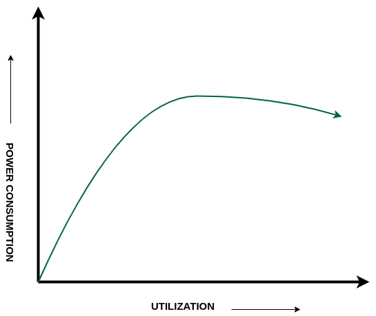
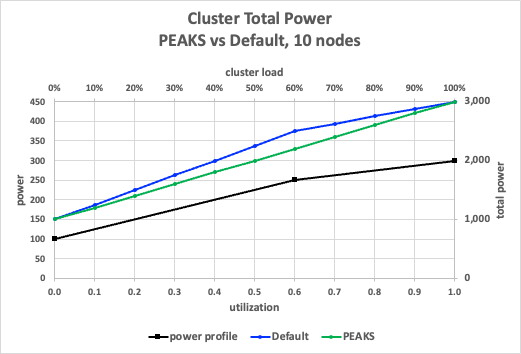
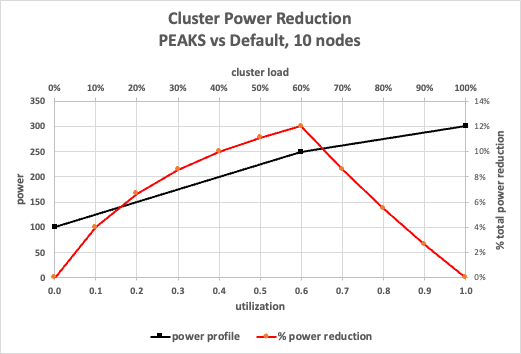
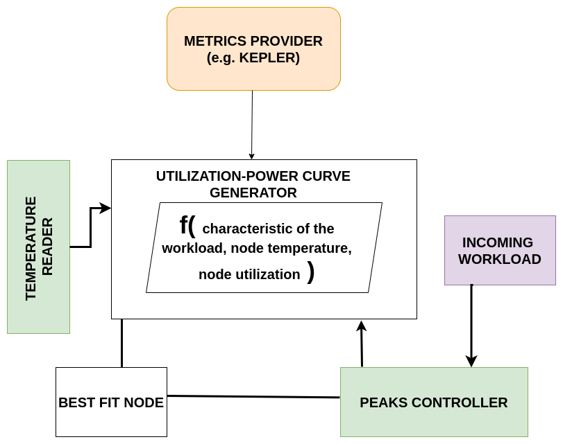

# PEAKS Overview

## Problem Statement

Existing Kubernetes schedulers mainly focus on improving only one objective, resource allocation (Trimaran) or topology/network optimization   or CPU/GPU optimization[2]. In recent years some work has been made on optimizing power via scheduling as well [3].  However, scheduling should incorporate multi-objective optimization, i.e optimization based not only on resource allocation or topology but also taking into account power or energy optimization. 

## Objectives

PEAKS (Power Efficiency Aware Kubernetes Scheduler) aims to optimize aggregate power consumption of the entire cluster at the scheduling time. PEAKS is based on a pre-trained Node Utilization vs Power Consumption ML models to predict best-fit nodes on which the workload should be scheduled depending on the resource requirement of the incoming workload. 

## Methodology

After running several benchmark tests to stress the utilization of the cluster, we observed that power consumption is significantly higher on underutilized nodes. As we increase the node utilization power consumption of the node improves significantly. As the node utilization approaches 60% and above the power consumption begins to flat out. 

  

Beyond that there is no significant difference in power consumption because as the temperature increases, the fan speed increases that adds to power consumption. We aim to determine in real time where the node lies on the utilization-power curve and depending on the resource requested by the incoming workload and the temperature of the node, PEAKS determines the best fit node for the incoming workload. 

In another tests attempt to assess the power reduction that PEAKS could achieve, compared to the default scheduler, we considered a CPU power profile consisting of two linear regions as shown below (deflection point at 0.6). Considering a cluster of 10 nodes that is subjected to some CPU load, varying from 0 to 100%. we did some simple calculations assuming that:
- the default scheduler spreads the load, and
- PEAKS packs the nodes.

PEAKS achieves best value of about 12% power reduction at 60% load. Obviously, PEAKS advantage diminishes as the load goes down to zero, or up to 100%.

  
   

## PEAKS FLOW

  

## Roadmap

### Peaks to be implemented 

#### Phase 1 

- Design finalization for the scheduler plugin
- Implementing the initial Power-Utilization Model 
- Prototyping the scheduler plugin component
- Proposing the KEP

#### Phase 2 

- KEP Review
- Possible OpenShift Secondary Scheduler Integration
- Design ideation of cluster autoscaler components

Utilizing the insights derived from outcomes 1 to 3 in crafting a comprehensive Kubernetes Enhancement Proposal (KEP). This proposal aims at the integration of PEAKS (Performance and Energy Aware Kubernetes Scheduler) into the Kubernetes ecosystem. The proposal, intended for presentation within the kubernetes-sigs community, meticulously outlines the steps and strategies for seamless integration, substantiated by empirical data, benchmarking, and community impact assessments.

### Key Components of the KEP

#### Integration Plan

Implementation coding of PEAKS functionalities into kubernetes-sigs/scheduler-plugins. This deliverable is a PR to be opened here. The objective is not immediate PR approval; however, the PR should be created, and the KEP should be submitted for community review.

#### Validation through Data

Presenting empirical evidence and data gathered from outcomes to validate the effectiveness of PEAKS. This includes a comparative analysis between PEAKS and the default Kubernetes Scheduler, highlighting the power savings and energy efficiency improvements achieved by PEAKS.

#### Benchmarking

Conducting rigorous benchmark tests to compare container scheduling performance between the default Kubernetes Scheduler and PEAKS. These benchmarks will encompass various scenarios; homogeneous and heterogeneous workload types (CPU/memory/IO intrinsic or a combination), providing quantitative metrics to support PEAKS' claims of superiority.

#### Community Impact 

Dcussing the potential impact of PEAKS on the Kubernetes community, addressing existing challenges, improving resource utilization, and contributing to the overall efficiency and sustainability of Kubernetes clusters.

#### Documentation and Support

Comprehensive documentation supporting PEAKS' claims on power optimization and energy savings. This includes literature on PEAKS methodology and evidence supporting the superiority of PEAKS methodology over the default Kube Scheduler.

### Expected Outcome

The team aims to initiate a collaborative effort within the Kubernetes-sigs community to integrate PEAKS as a Kubernetes Scheduler plugin. Through rigorous testing and empirical data, the team will provide compelling evidence of PEAKS' value in optimizing energy efficiency and power performance.

## Milestone Dec 2023

- Continue upstream development using scheduler plugin paradigm for PEAKS
- Define the scoring function/ What resources we are including
- Provide the evidence of the performance of the scoring function
- Propose Kubernetes Enhancement Proposal for PEAKS in sig-scheduling

## References

[1] https://dl.acm.org/doi/10.1145/3378447

[2] Thinakaran P, Gunasekaran JR, Sharma B, Kandemir MT, Das CR (2019) Kube-Knots: Resource Harvesting through Dynamic Container Orchestration in GPU-based Datacenters. Proceedings - IEEE International Conference on Cluster Computing, ICCC
[Google Scholar](http://scholar.google.com/scholar_lookup?&title=Kube-Knots%3A%20Resource%20Harvesting%20through%20Dynamic%20Container%20Orchestration%20in%20GPU-based%20Datacenters&publication_year=2019&author=Thinakaran%2CP&author=Gunasekaran%2CJR&author=Sharma%2CB&author=Kandemir%2CMT&author=Das%2CCR)

[3] Townend P et al (2019) Invited paper: Improving data center efficiency through holistic scheduling in kubernetes. Proceedings - 13th IEEE International Conference on Service-Oriented System Engineering, 10th International Workshop on Joint Cloud Computing, and IEEE International Workshop on Cloud Computing in Robotic Systems, CCRS. pp 156–166
[Google Scholar](http://scholar.google.com/scholar_lookup?&title=Invited%20paper%3A%20Improving%20data%20center%20efficiency%20through%20holistic%20scheduling%20in%20kubernetes&pages=156-166&publication_year=2019&author=Townend%2CP)

[4]  Zhong Z, Buyya R (2020) A Cost-Efficient Container Orchestration Strategy in Kubernetes-Based Cloud Computing Infrastructures with Heterogeneous Resources. ACM Trans Internet Technol 20(2):1–24
[Article Google Scholar](http://scholar.google.com/scholar_lookup?&title=A%20Cost-Efficient%20Container%20Orchestration%20Strategy%20in%20Kubernetes-Based%20Cloud%20Computing%20Infrastructures%20with%20Heterogeneous%20Resources&journal=ACM%20Trans%20Internet%20Technol&doi=10.1145%2F3378447&volume=20&issue=2&pages=1-24&publication_year=2020&author=Zhong%2CZ&author=Buyya%2CR)
